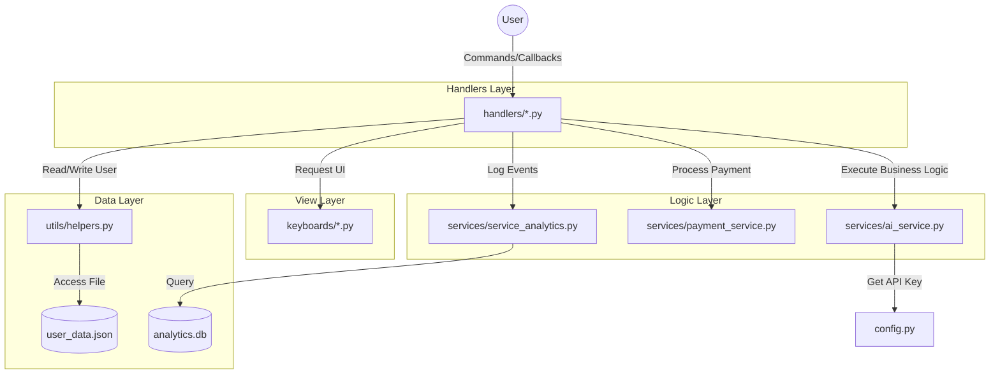

# DEPENDENCY_FLOW.md - Aliran Dependensi & Hubungan Modul

Dokumen ini menjelaskan bagaimana modul-modul dalam proyek saling berinteraksi.

## 📊 Diagram Aliran (High Level)

## 🔗 Hubungan Penting (Coupling)

1. **Handlers ↔ Keyboards**: Hampir setiap handler mengimpor fungsi keyboard. Perubahan signature fungsi di `keyboards/` akan mematahkan banyak handler sekaligus.
2. **Handlers ↔ FSM States**: `handlers/tools.py` sangat bergantung pada `states/tool_states.py`. Jangan mengubah nama state tanpa mengupdate handler-nya.
3. **Services ↔ Config**: Semua service bergantung pada `config.py` untuk API Keys dan Path file.
4. **Utils ↔ Data**: `utils/helpers.py` adalah satu-satunya pintu masuk ke `user_data.json`. Modul lain dilarang mengakses JSON secara langsung.

## 🔄 Callback Flow (Contoh: Fitur Tools)
1. **`menu_tools`** (callback) → Menampilkan daftar alat.
2. **`tool_{code}`** (callback) → Set FSM state `waiting_for_input`.
3. **User sends text** (message) → Validasi limit & Tampilkan pilihan gaya (`st_{code}`).
4. **`st_{code}`** (callback) → Panggil `ai_service.py` & Tampilkan hasil akhir.
5. **`act_regen`** (callback) → Jalankan ulang poin 4 tanpa minta input teks lagi.

## ⚠️ Rantai Dependensi Berbahaya
- `utils/helpers.py` → `config.py` → `.env`
- Jika `.env` bermasalah, `config.py` akan gagal, lalu `helpers.py` akan error, dan akhirnya bot tidak bisa start sama sekali.
